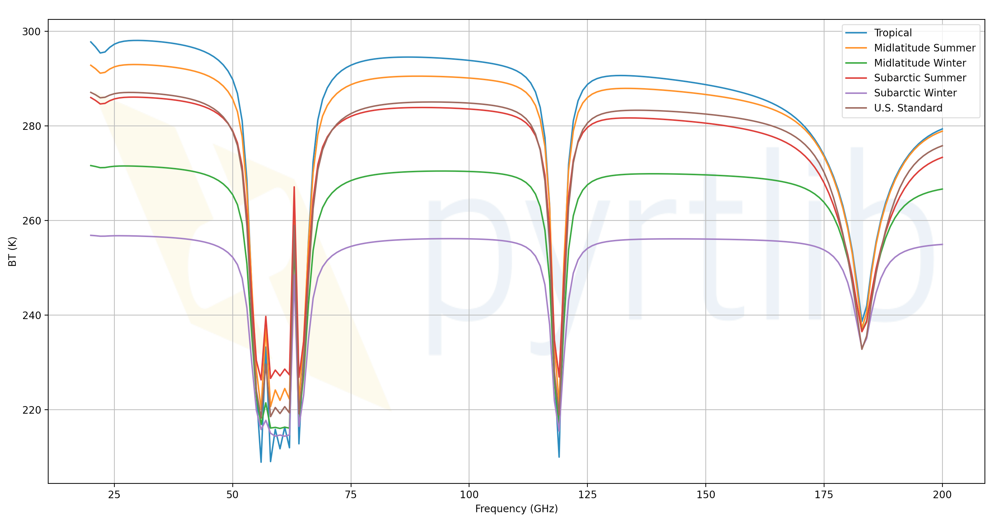

# **pyrtlib** - Radiative Transfer python library

[](https://github.com/slarosa/pyrtlib/actions/workflows/build_docs.yml)
[](https://github.com/slarosa/pyrtlib/actions/workflows/ci.yml)
[](https://www.repostatus.org/#active)
[](https://github.com/slarosa/pyrtlib/commits/main)
[](https://codecov.io/gh/slarosa/pyrtlib)
<!-- [](https://github.com/slarosa/pyrtlib/blob/main/LICENSE.md) -->

A python package to compute atmospheric radiative transfer model based on the radiative transfer equation (RTE).



# Example

For some example of usage of the pyrtlib see the [examples gallery](docs/examples). Code can be downloaded both a python script or notebook file.

## Performing calculation of brigthness temperature for a model.
Atmospheric profile definition:

```python
>>> z, p, _, t, md = atmp.gl_atm(atmp.TROPICAL)
```
Units conversion:
```python
>>> gkg = ppmv2gkg(md[:, atmp.H2O], atmp.H2O)
```
Relative humidity of H2O (water vapor)
```python
>>> rh = mr2rh(p, t, gkg)[0] / 100
```
Deifinition of angles and frequencies:
```python
>>> ang = np.array([90.])
>>> frq = np.arange(20, 201, 1)
```
Initialization of liquid and ice array (not used in clear-sky):
```python
>>> denliq = np.zeros(z.shape)
>>> denice = np.zeros(z.shape)
>>> cldh = np.zeros((2, 0))
```
Execution of the main script:
```python
>>> df = tb_cloud_rte(z, p, t, rh, denliq, denice, cldh, frq, ang,
...         absmdl='rose16',
...         ray_tracing=True,
...         from_sat=True)
>>> df.tbtotal
0      297.391838
1      296.186240
2      294.748245
3      294.953483
4      296.027799
         ...
176    275.997899
177    276.611319
178    277.129218
179    277.566840
180    277.936645
Name: tbtotal, Length: 181, dtype: float64
```
